# 在大学写的基于文本相似度的图书推荐系统

### 实现的功能

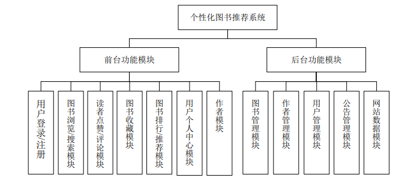
推荐一块使用协同过滤的思想，计算物品之间的相似度

web框架使用Flask，小说还支持在线看的

主要功能截图 用户基本模块：包含的主要功能有用户注册、登录
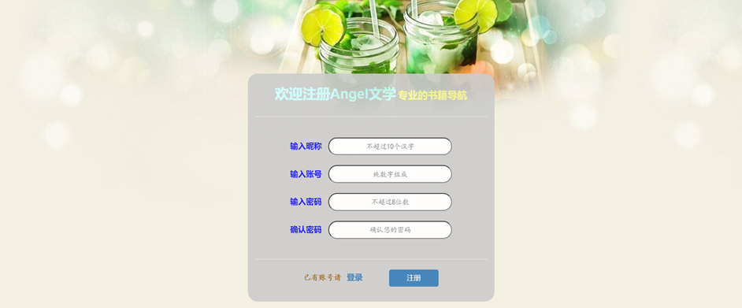
图书模块：包含的主要功能有根据浏览热度排行的图书展示、根据分类展示、搜索图书、图书详情展示、被推荐图书展示
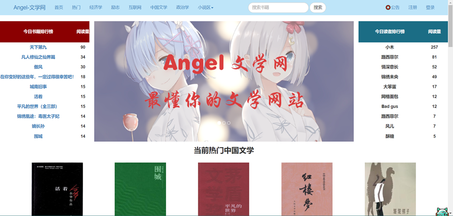

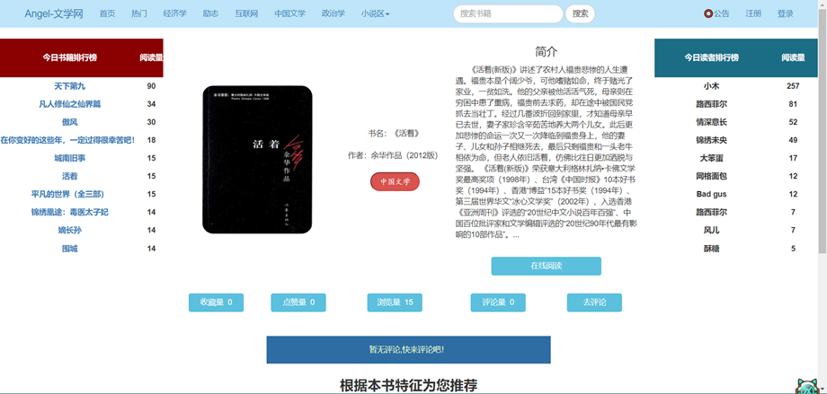
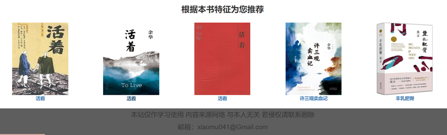
评论模块：功能有评论展示、用户对图书评论、评论修改，也可以对感兴趣的图书进行点赞和收藏
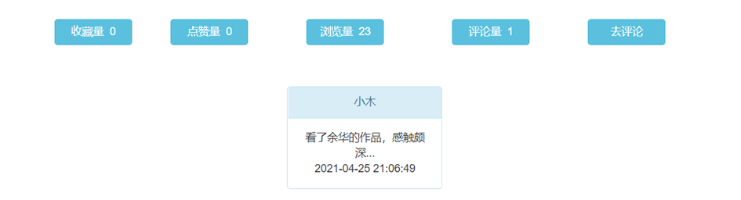
公告模块：用户查看系统公告、管理员增删改查公告信息
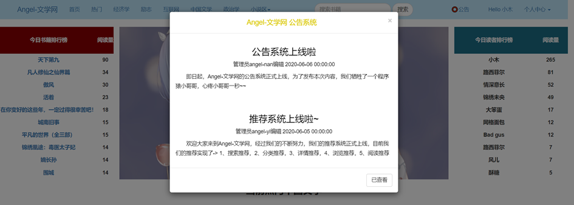
用户个人中心模块：包含了用户基本信息展示、用户等级展示（普通用户、会员、认证作者）、用户积分展示、展示系统根据用户历史数据推荐的图书、查看个人点赞、收藏、评论的书籍、查看历史阅读记录可以续读
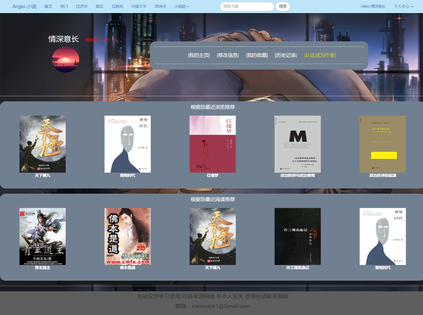
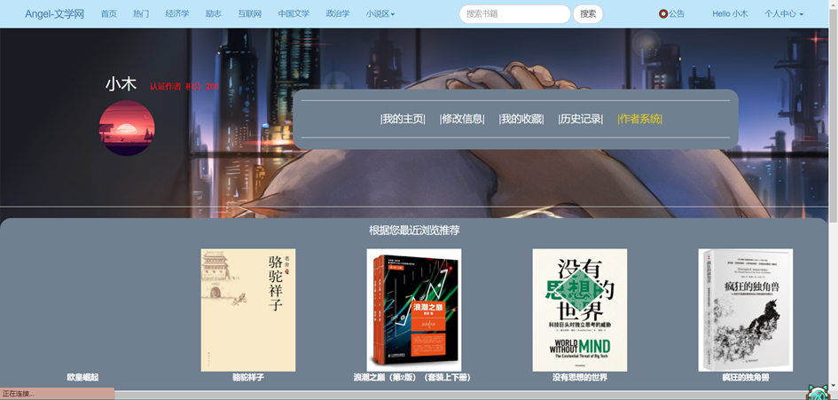
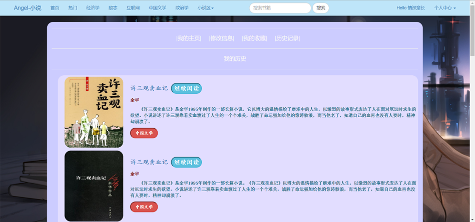
作者模块：认证为作者后用户可以新建、编辑、删除自己的书籍、展示作者发布的图书、展示图书对应的统计信息（浏览量、点赞量、收藏量、评论数据）、申请新增图书分类、编辑选定图书内容、编辑新章节、查看个人粉丝数量
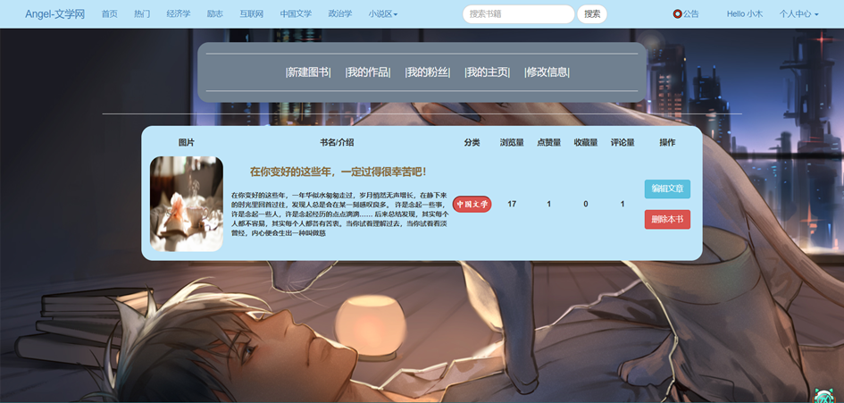
后台功能模块实现 （1）图书管理模块：管理员可批量导入、编辑、删除图书、改变图书展示状态（上下架）、审核作者新建的图书； （2）用户管理模块：查看用户信息、编辑用户等级、审核用户提交的作者认证、编辑公告；
（3）系统管理模块：查看系统运行日志、备份和恢复各项数据、查看各项数据统计（图书信息统计、用户信息统计、时间段内新增图书和新增用户、访客统计）
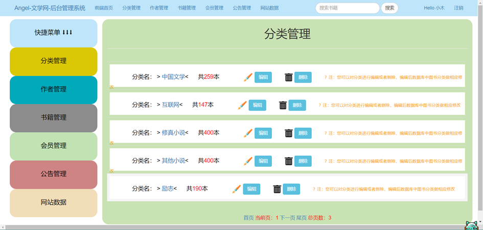

思路

整体设计：每个部分程序分开设计

按照推荐位置设计不同的推荐方式

分类页：所有的框架分类有8个，设计一个统一模板，不论到哪一个分类都会实现

推荐方式：本分类下浏览量最高的10本

设计：

1.获取分类名，

2.查此分类下浏览量最高的十本，

3.将此10个数据发送到分类页

搜索页：设计统一模板，输入任何关键词都有推荐

推荐方式：按照搜索词匹配浏览量最高的10本

设计：

1。获取搜索词，

2。查找搜索词对应的数据，

3.将所得数据按照浏览量排序，

4 .截取10本发送前端

详情页：设计统一模板，进来一本书就按照这本书取推荐

推荐方式：文字匹配，相似度最高的5本

设计：

1.将所有图书的简介进行分词，

2.将所有的分词写入到static里面的fenci.csv中，

3.构建分词矩阵，

4.获取用户所点击进来这本书的描述并进行分词，

5.将描述信息放入到分词矩阵中做矩阵相乘

5.拿到最相似的5本返回前端，

个人主页：设计统一模板，不同的人推荐不同的数据（这一部分还需要再考虑，不太熟悉）

推荐方式：协同过滤推荐

设计

1：获取用户的历史浏览数据，

2.生成总的用户库，

3.构建用户矩阵，

4.得到用户画像，

5.计算最相近的用户

6。找到最相近用户下那个用户看过的这个用户没有看的书，

7.将那些书推荐给这个用户，

设计2：

1.获取用户的历史浏览数据，

2.生成总的图书库，

3.构建图书矩阵，

4.计算最相近的图书，

5.学习网易云推荐方式 （网易云的推荐采用用户喜欢的一首歌，推荐另一首或多首相似度较高的歌曲），根据用户看过的书使用详情页的分词库进行推荐，

6.将那些书推荐给这个用户，